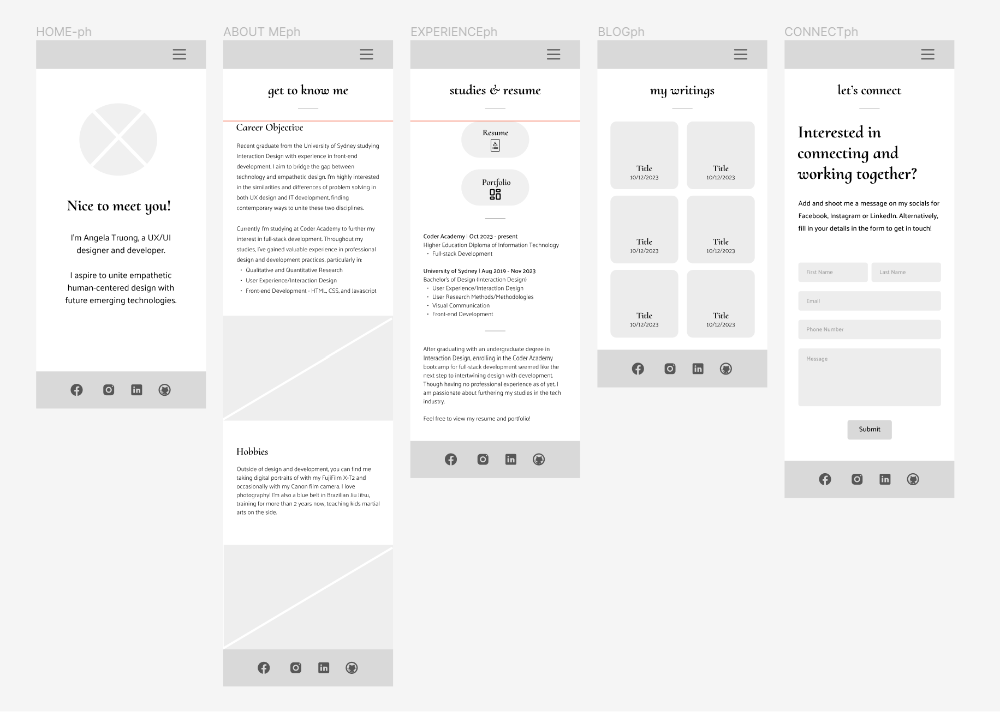
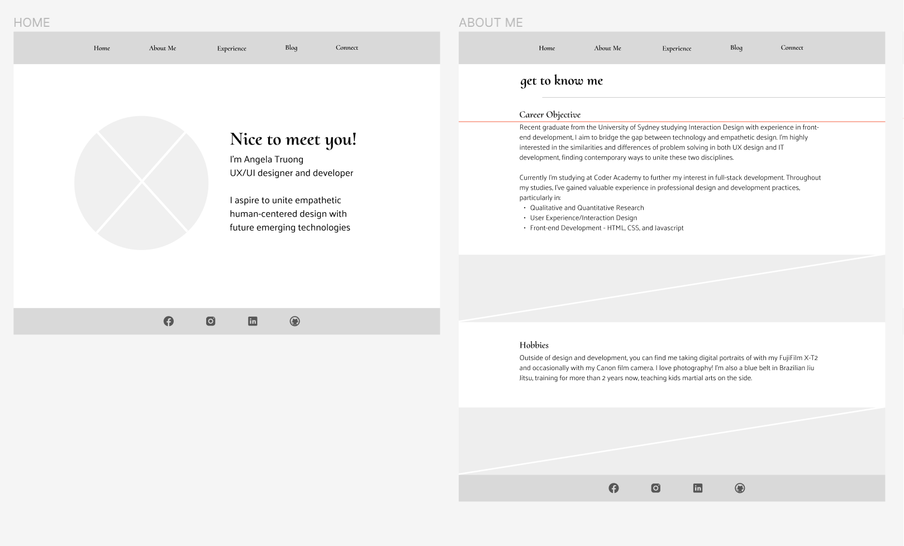
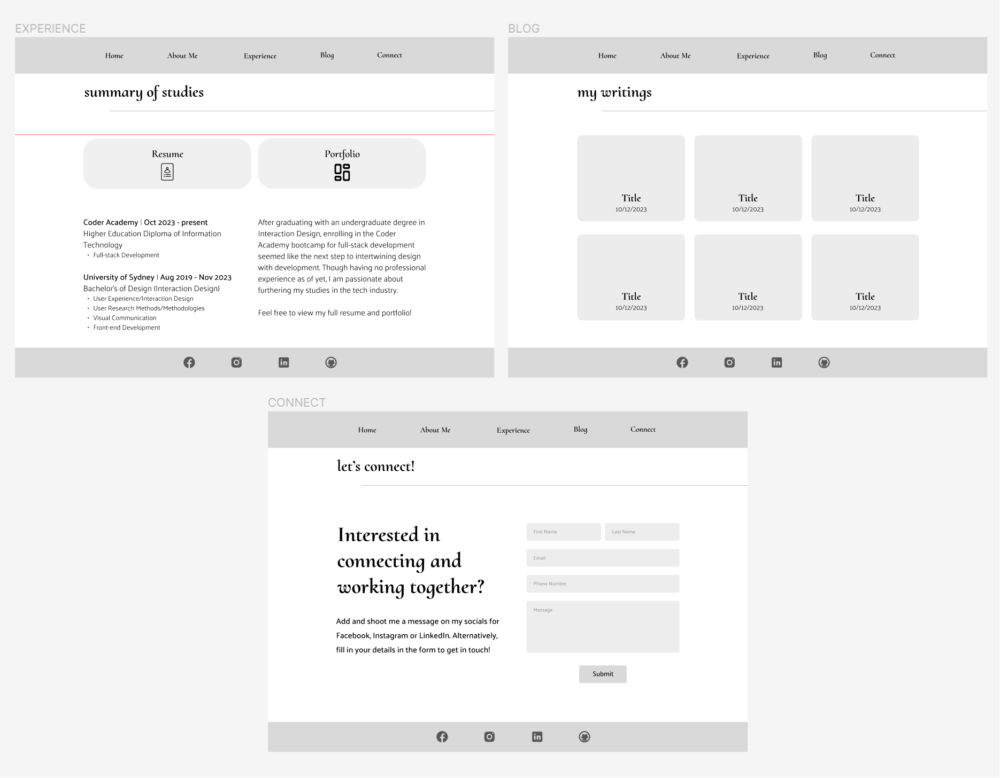
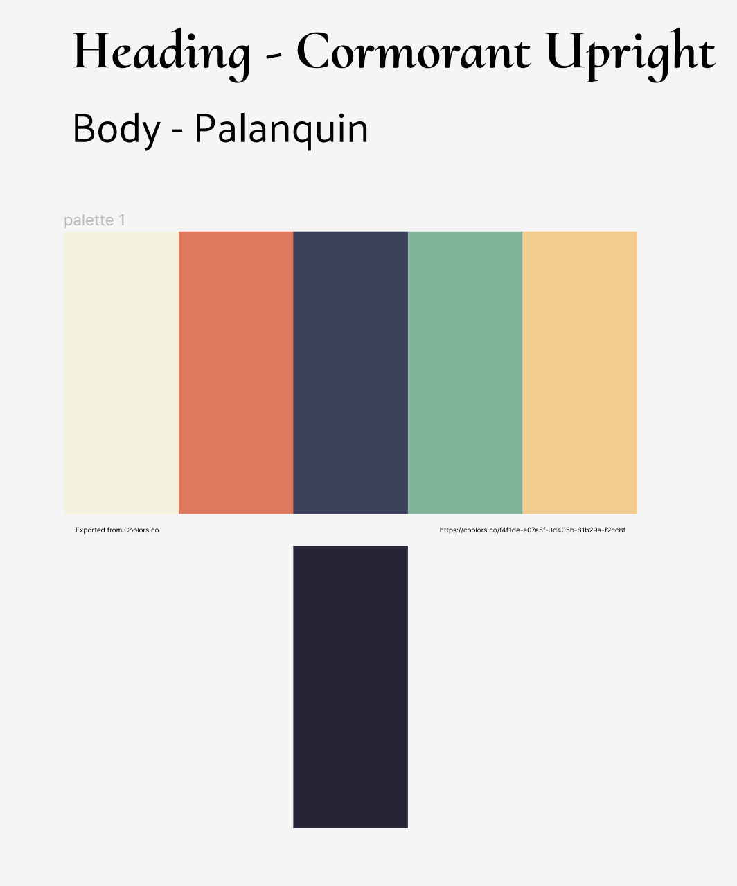
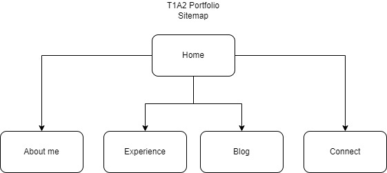
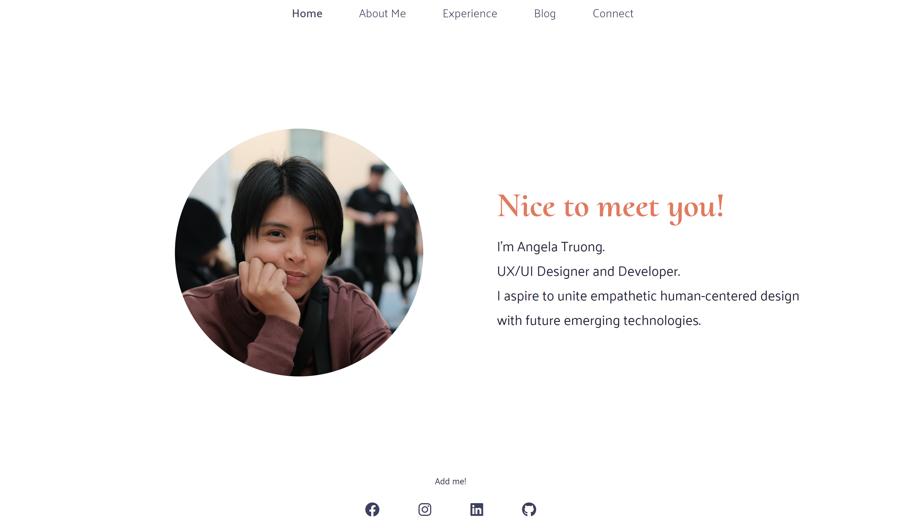
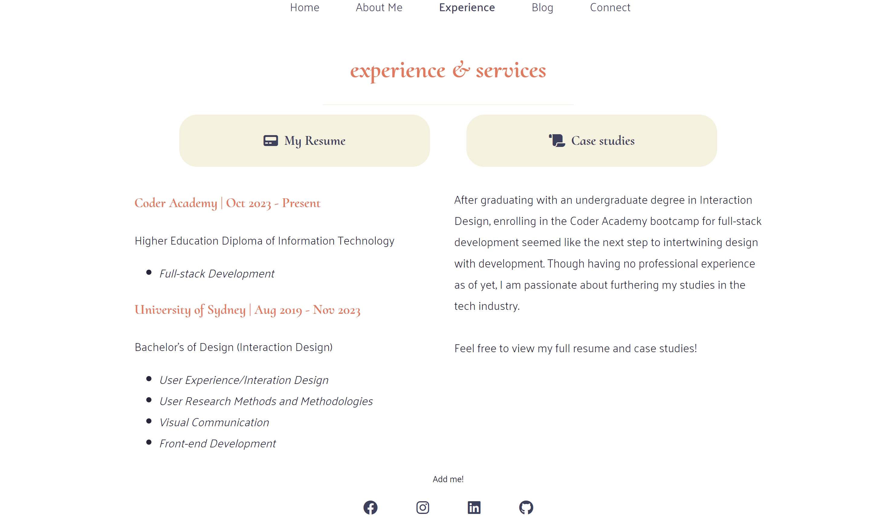
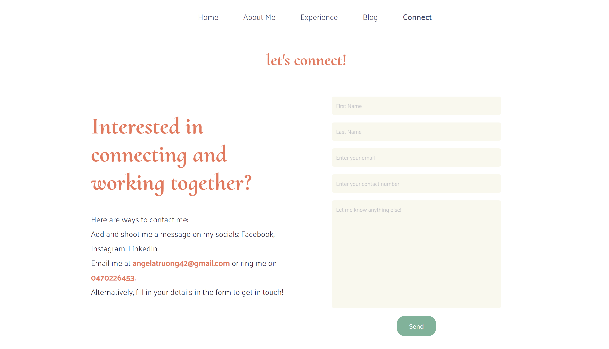
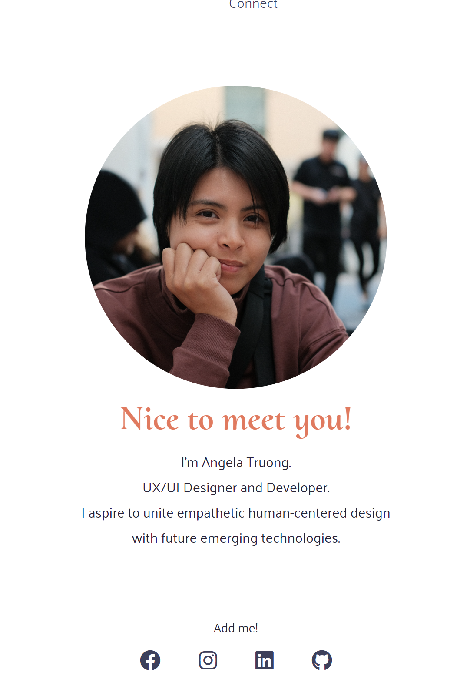
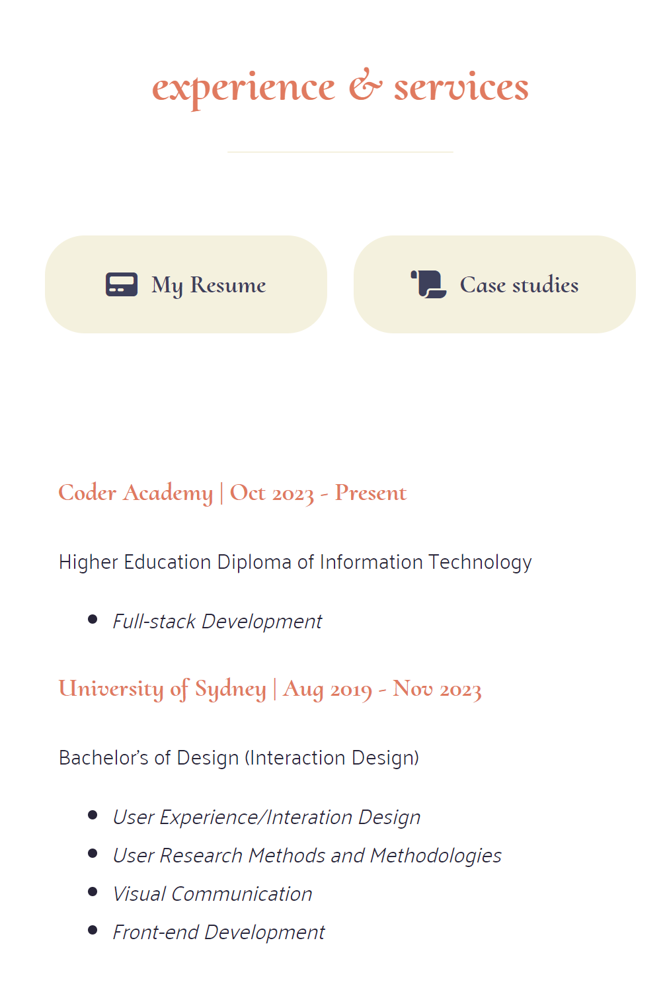

# T1A2 - Portfolio 

**Portfolio Website Link**:  
**GitHub Repo**: https://github.com/angelatru/AngelaTruong_T1A2  
**Presentation Video**:

## Description of Portfolio Website

This portfolio website uses HTML, CSS to write the responsive website and uses Netlify to host. Wireframes were done in in Figma prior to coding to figure out in advanced the layout, font and typography, and colours.

The main purpose of this particular portfolio website is to introduce myself as both a designer and developer. The website aims to be inviting with pops of colours to make a clean and interesting look. The target audience for this portfolio are recruiters of the tech industry that recieves large volumes of applicants. My portfolio aims to showcase who I am, what I provide, and my career aspirations at a glance which makes for digesting information quickly and easily. 

The site features five main pages:
* **Home**: An inviting landing page introducing myself with an image, my career title, and a brief introduction on what my aspirations in the industry are. The information is large and central for clear viewing.
* **About Me**: Further talking about my career aspirations as well as getting to know me more outside of the industry by detailing my hobbies.
* **Experience**:  A quick summary of my notable study history and links to my full resume and UX/UI case studies.
* **Blog**: A simple 3x3 grid made up of sample blog posts about cats. As I develop my portfolio further, this is where I plan on integrating my case studies for ease of viewing rather than linking to an external site. I chose cats to be the main subject of the placeholder text and image because who doesn't like cats?!
* **Connect**: A final page outlining ways to contact me including my phone number, email, socials and a form so that recruiters may choose however way to link up.

In addition to these pages, the site is responsive for accessibility on various screen sizes and the footer further links to my socials. It also takes in consideration user feedback when hovering and clicking links to make engagement more intuitive.

## Images:
### Wireframes:

### Site Sample Screenshots:

